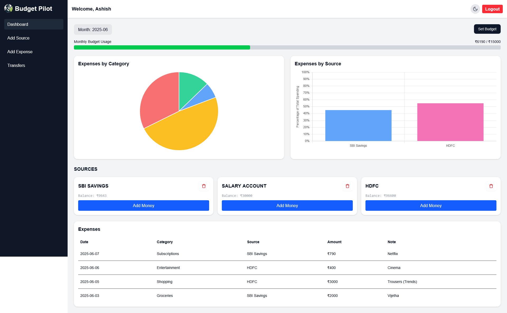
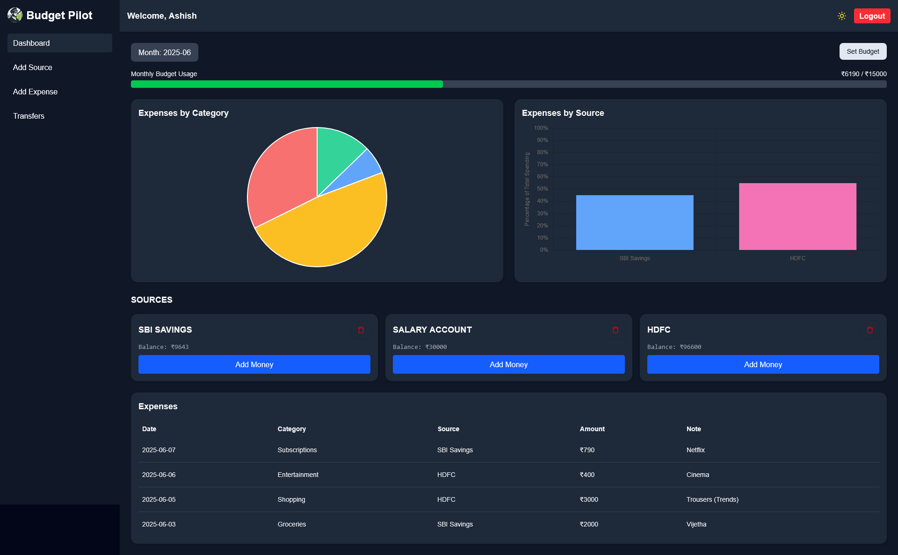
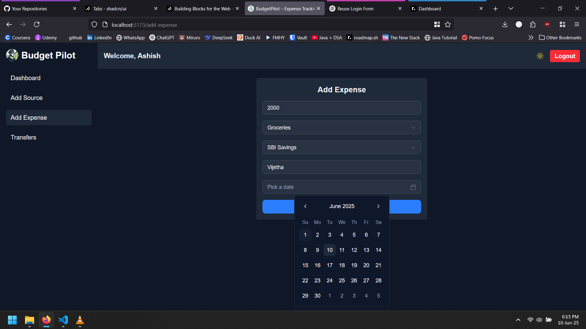
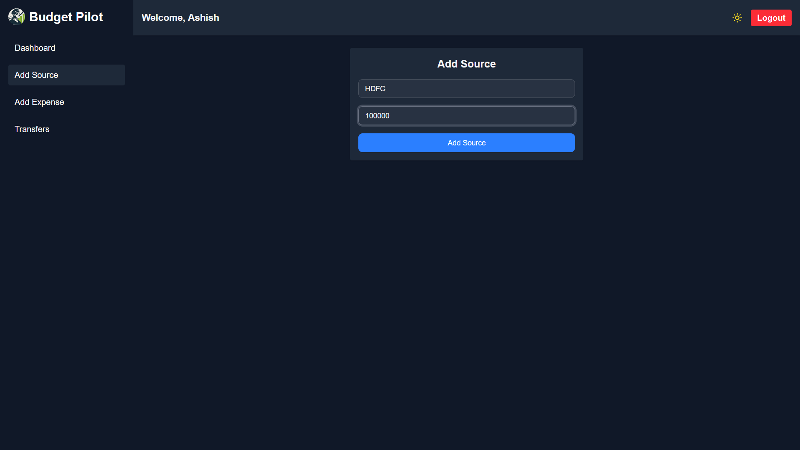
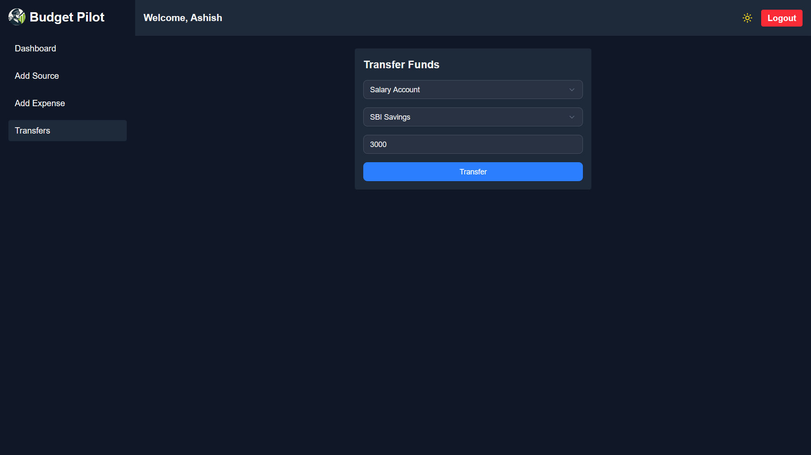

# Budget-Pilot

Expense tracker dashboard built with the MERN stack that helps users to track their expenses across various sources, manage budgets, and gain insights through visual analytics.

---

## Features

- User authentication with JWT (HTTP-only cookie for refresh token)
- Dashboard with monthly budget overview
- Add/Edit/Delete income sources, expenses
- Visualize spending with charts (Chart.js)
- Track budget utilization with progress bar
- Dark mode toggle
- Toast notifications for UX
- Zustand for global state management
- Monthly budget limit excluding internal transfers b/w sources

---

## Screens & Visuals

  
  
    
  
  
  

- **Dashboard** – Monthly expense summary, charts, budget utilization
- **Add Expense** – Input fields with validation, category, source
- **Manage Expenses** – Edit/delete previous entries
- **Charts** – Pie chart by category, bar chart by source expenditure

## Tech Stack

### Frontend

- React.js (Vite)
- Tailwind CSS + shadcn/ui
- Zustand (state management)
- React Router DOM
- react-hook-form + zod (form validation)
- Chart.js (data visualization)
- react-hot-toast (toast notifications)

### Backend

- Node.js + Express.js
- MongoDB + Mongoose
- JWT-based authentication with refresh tokens
- Bcrypt (password hashing)

---

## Future Plans

- Add recurring transactions support
- Multi-user support with shared budgets
- Export/Import feature (CSV, JSON)
- Advanced filtering and search

---

## License

[MIT](LICENSE)
